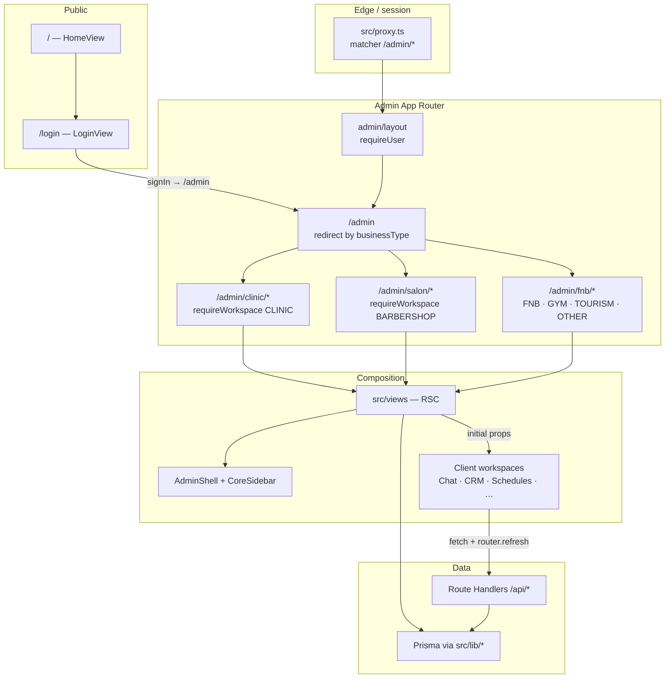
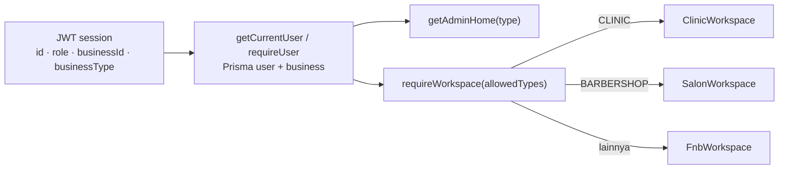
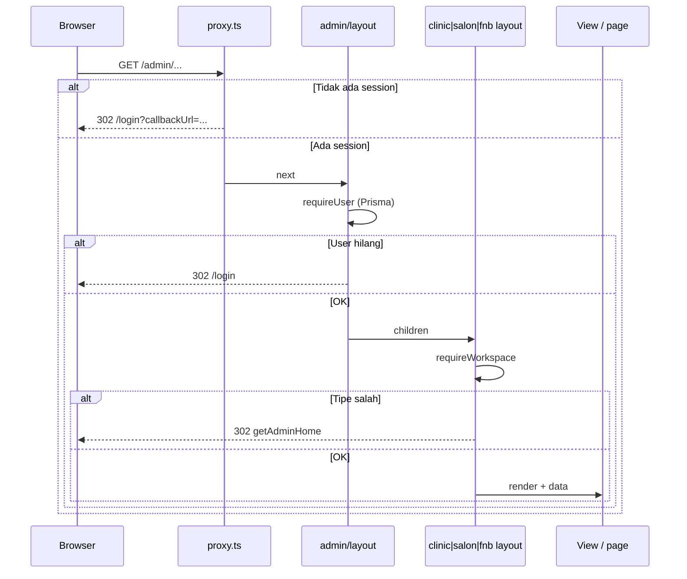
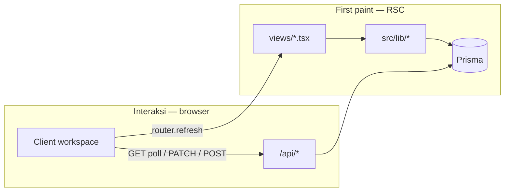
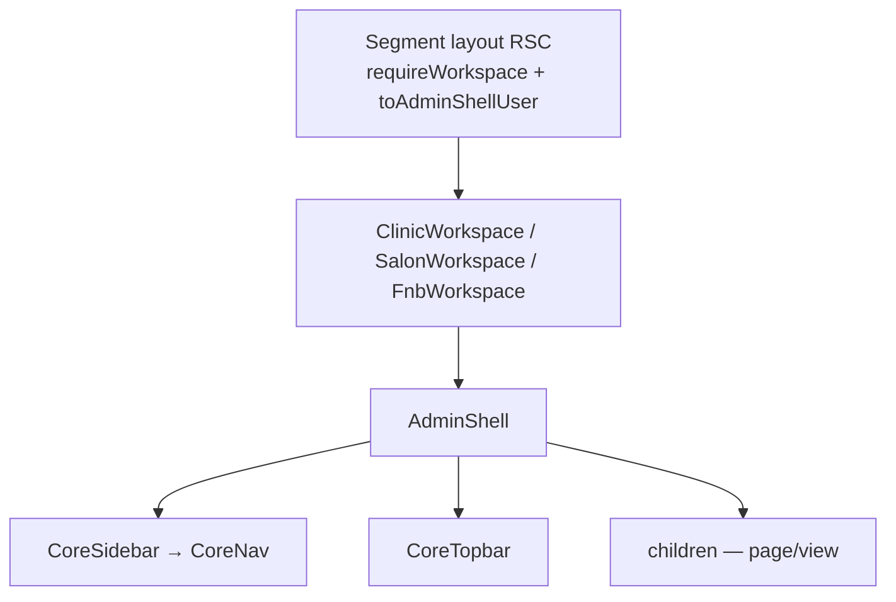

# DIUK Solution — Frontend System Design

Dokumen ini merangkum arsitektur frontend DIUK Solution: platform conversational AI & automation untuk bisnis (klinik, salon/barbershop, F&B, dan tipe lain). Fokusnya adalah bagaimana UI dibangun, dilindungi, diarahkan per tenant, dan dihubungkan ke data.

**Stack:** Next.js 16 (App Router) · React 19 · TypeScript · Tailwind CSS v4 · NextAuth v5 · Prisma 6

---

## 1. Tujuan & batasan

### 1.1 Tujuan produk di sisi FE

- Landing marketing untuk akuisisi.
- Login (Google + credentials) lalu masuk ke workspace admin sesuai jenis bisnis.
- Satu shell admin yang dipakai ulang, dengan navigasi dan copy yang berbeda per industri.
- Operasi harian: chat WhatsApp, janji/reservasi, CRM, jadwal, layanan, dokter/stylist, AI automation, settings.

### 1.2 Prinsip desain FE

| Prinsip | Implementasi |
|---------|----------------|
| Thin pages | `src/app/**/page.tsx` hanya merender view |
| Shared workspace, variant copy | Komponen admin sama; label/nav berubah per `businessType` |
| Server-first | Data awal di-load di React Server Components (Prisma / lib) |
| Client untuk interaksi | Polling, form, CRUD, sidebar, chat |
| Tenant isolation di server | `businessId` dari session; layout menolak tipe bisnis yang salah |
| Defense in depth | Proxy → admin layout → segment layout |

### 1.3 Bukan tanggung jawab FE

- Webhook WhatsApp / Midtrans (server-only).
- Callback OAuth Google Calendar (API route).
- Inferensi LLM (backend `src/lib/ai`).
- Tidak ada WebSocket/SSE; “live” = polling HTTP.

---

## 2. High-level architecture



**Alur baca yang disarankan:** route (`app`) → view (`views`) → shell/nav → workspace client → API atau Prisma.

---

## 3. Tech stack

| Layer | Pilihan | Catatan |
|-------|---------|---------|
| Framework | Next.js **16.3.4** App Router | `src/proxy.ts` sebagai auth gate (bukan `middleware.ts`) |
| UI | React **19.2.8** | Server Components default |
| Bahasa | TypeScript 5 | Path alias `@/` |
| Styling | Tailwind CSS **v4** | Token di `src/app/globals.css` (`@theme inline`) |
| Motion | framer-motion 13 | Landing |
| Auth | next-auth **5** (beta) | JWT; Google + Credentials |
| Data server | Prisma 6 + `@prisma/client` | Dipakai views & API, bukan dari browser |
| Ikon | Material Symbols Outlined | Wrapper `src/components/ui/icon.tsx` |
| Font | Geist Sans + Geist Mono | `next/font/google` di root layout |

**Ada di `package.json` tapi tidak dipakai di `src/`:** `@supabase/ssr`, `@supabase/supabase-js`.

---

## 4. Struktur folder

```
src/
├── app/                      # App Router: page, layout, loading, API
│   ├── layout.tsx            # Root: font, metadata, Material Symbols
│   ├── globals.css           # Design tokens
│   ├── page.tsx              # Landing
│   ├── login/page.tsx
│   ├── admin/
│   │   ├── layout.tsx        # requireUser
│   │   ├── page.tsx          # Redirect ke home workspace
│   │   ├── clinic|salon|fnb/ # Segment + loading
│   └── api/                  # Route Handlers
├── views/                    # Komposisi per route (umumnya async RSC)
│   ├── home.tsx
│   ├── login.tsx
│   └── admin/{clinic,salon,fnb}/
├── components/
│   ├── admin/                # Shell, chat, CRM, appointments, …
│   ├── auth/
│   ├── landing/
│   └── ui/icon.tsx
├── data/landing-page.ts      # Konten marketing statis
├── lib/                      # Domain server + helper
├── types/next-auth.d.ts
├── auth.ts
├── auth.config.ts
└── proxy.ts
```

**Konvensi:** page tipis; logika layar di `views`; UI interaktif di `components/admin/*`; akses data di `lib/*`.

`src/components/Navbar.tsx` ada tetapi tidak dipakai.

---

## 5. Routing & information architecture

### 5.1 Public

| Route | View | Perilaku |
|-------|------|----------|
| `/` | `HomeView` | Landing (hero → CTA) |
| `/login` | `LoginView` | Jika sudah ada session → `/admin` |

### 5.2 Admin hub

`/admin` memanggil `requireUser()` lalu `redirect(getAdminHome(businessType))`.

### 5.3 Pemetaan `BusinessType` → prefix URL

| `BusinessType` (Prisma) | Prefix | Label UI |
|-------------------------|--------|----------|
| `CLINIC` | `/admin/clinic` | Clinic · Beauty & Aesthetic |
| `BARBERSHOP` | `/admin/salon` | Salon · Salon & Barbershop |
| `FNB`, `GYM`, `TOURISM`, `OTHER` | `/admin/fnb` | F&B (bucket) |

Salah tipe → `requireWorkspace` mengarahkan ke home yang benar. Tidak ada guard client-side untuk ini.

### 5.4 Clinic — modul & kematangan

Navigasi: `getClinicNav()` di `src/views/admin/clinic/workspace.tsx`.

| Route | UI utama | Data |
|-------|----------|------|
| `/admin/clinic` | `AppointmentDashboardPage` | Mock KPI / board |
| `/admin/clinic/chat` | `ChatWorkspace` | Live Prisma + polling |
| `/admin/clinic/appointments` | `DayCalendarWorkspace` | Prisma day schedule + PATCH |
| `/admin/clinic/crm` | `CrmWorkspace` | Prisma + PATCH notes/tags/follow-ups |
| `/admin/clinic/doctors` | `DoctorListWorkspace` | CRUD practitioners + Google Calendar |
| `/admin/clinic/services` | `ServicesWorkspace` | CRUD services |
| `/admin/clinic/schedules` | `SchedulesWorkspace` | Doctor hours + calendar |
| `/admin/clinic/automation` | `AiAutomationWorkspace` | Settings + PATCH |
| `/admin/clinic/settings` | `WorkspaceSettings` | Profil + WhatsApp Cloud |
| `/admin/clinic/analytics`, `/reports`, `/help` | `AdminModulePage` | Placeholder |
| `/leads`, `/patients`, `/workflows` | Placeholder | Ada route, **tidak di sidebar** |

### 5.5 Salon

| Route | Status |
|-------|--------|
| Dashboard | UI lengkap, data mock |
| Chat, CRM, Settings | Live (pola sama clinic) |
| Clients, appointments, stylists, services, schedules, leads, automation, workflows, analytics, reports, help | Placeholder `AdminModulePage` |

### 5.6 F&B bucket

| Route | Status |
|-------|--------|
| Dashboard | `BusinessDashboard` — shell + nama/tipe bisnis |
| Chat, Settings | Live |
| Reservations, Help | Placeholder |

### 5.7 Loading

`clinic/loading.tsx`, `salon/loading.tsx`, `fnb/loading.tsx` → `AdminPageLoading`. Tidak ada `error.tsx` di `src/app`.

---

## 6. Multi-tenant & workspace



- **Kunci tenant:** `user.businessId`. Views dan API selalu scoped ke bisnis user yang login.
- **Satu user = satu bisnis** (`User.businessId`, on delete restrict).
- **Role** (`ADMIN` | `STAFF`) ada di session; sidebar belum membedakan menu per role.
- **Shared components, beda copy:** chat `variant`: `clinic` | `salon` | `fnb`; appointment copy lewat `getAppointmentCopy(businessType)`; CRM mengubah label pelanggan dan `chatBaseHref`.

---

## 7. Auth & session

### 7.1 Provider

Dikonfigurasi di `src/auth.ts` + `src/auth.config.ts`. Handler: `src/app/api/auth/[...nextauth]/route.ts`.

| Provider | Syarat | Masuk ke |
|----------|--------|----------|
| Google | User sudah terdaftar, `authProvider === "GOOGLE"` | `signIn("google", { redirectTo: "/admin" })` |
| Credentials | `username` + password bcrypt, `authProvider === "CREDENTIALS"` | Server action `loginWithCredentials` |

Session strategy: **JWT**. Field tambahan (`src/types/next-auth.d.ts`): `id`, `role`, `businessId`, `businessType`, `authProvider`.

Google OAuth memakai `CLIENT_ID` / `CLIENT_SECRET`. `trustHost: true`. `pages.signIn = /login`.

### 7.2 Tiga lapis proteksi



1. **`src/proxy.ts`** — NextAuth edge (`authConfig` saja, tanpa callback Prisma). Matcher `/admin`, `/admin/:path*`.
2. **`src/app/admin/layout.tsx`** — `requireUser()`.
3. **Segment layout** — `requireWorkspace([...])` lalu bungkus `ClinicWorkspace` / `SalonWorkspace` / `FnbWorkspace`.

`getCurrentUser` di-cache per request (`react.cache`) + `auth()` + Prisma `include: { business: true }`.

### 7.3 Sign-out

Server action `signOut({ redirectTo: "/login" })` dari topbar.

---

## 8. Pola komponen: RSC vs client

### 8.1 Default: Server Components

Hampir semua `page.tsx` dan `src/views/**` adalah async RSC: `requireUser`, load Prisma, kirim props ke client.

Contoh chat clinic:

1. `ClinicChatView` → `getLiveChatWorkspace(businessId, "clinic")`.
2. Render `ChatWorkspace` (client) di dalam `Suspense` (karena `useSearchParams`).
3. Client me-poll inbox/pesan jika `data.live === true`.

### 8.2 Client (`"use client"`)

Dipakai untuk: shell (sidebar, topbar, collapse, mobile), chat, CRM, schedules, doctors, services, AI automation, WhatsApp settings, appointment board, landing, form login.

Tidak ada React Context global. State lokal (`useState` / `useRef`) + URL + `router.refresh()`.

### 8.3 Server actions (sempit)

Hanya auth: `loginWithCredentials`, Google `signIn`, `signOut`. Mutasi domain lewat **Route Handlers + `fetch`**, lalu sering `router.refresh()` (kadang `useTransition`).

---

## 9. Data fetching

### 9.1 Pola ganda



| Sumber | Kapan | Contoh |
|--------|--------|--------|
| Prisma di RSC | Load awal | Chat inbox, CRM, day calendar, doctors, services, schedules, AI settings, WhatsApp connection |
| `fetch` ke `/api` | Mutasi & poll | Chat, unread, CRM patches, CRUD doctors/services, doctor-hours, AI, WhatsApp credentials |
| Mock di lib | Dashboard appointment | `getAppointmentDashboardData` — **bukan Prisma** |

### 9.2 API yang dipanggil browser

| Method | Path | Pemakai |
|--------|------|---------|
| GET | `/api/chat/unread-count` | Sidebar badge, poll 4s |
| GET | `/api/chat/conversations` | Inbox, poll 2.5s |
| GET | `/api/chat/conversations/[id]/messages` | Thread, poll 1.5s |
| POST | `/api/chat/conversations/[id]/read` | Tandai dibaca |
| PATCH | `/api/chat/conversations/[id]/ai` | Toggle AI per percakapan |
| POST | `/api/chat/messages` | Kirim WhatsApp outbound |
| PATCH | `/api/appointments/[id]` | Status di day calendar |
| PUT | `/api/schedules/doctor-hours` | Schedules |
| GET/POST/PUT/DELETE | `/api/services`, `/api/services/[id]` | Services |
| GET/POST/PATCH/DELETE | `/api/practitioners`, `/api/practitioners/[id]` | Doctors |
| GET (navigasi) | `/api/integrations/google-calendar/connect?practitionerId=` | Mulai OAuth |
| POST | `/api/integrations/google-calendar/disconnect` | Putus kalender |
| PUT/DELETE | `/api/whatsapp/connection` | Settings |
| PATCH | `/api/ai/automation` | Automation |
| PATCH + subroute | `/api/crm/contacts/[id]`, `.../notes`, `.../tags`, `.../follow-ups` | CRM |

**Bukan dari browser:** `/api/webhooks/whatsapp`, `/api/webhooks/midtrans`, `/api/integrations/google-calendar/callback`.

---

## 10. State management

| Mekanisme | Dipakai untuk |
|-----------|----------------|
| `useState` / `useRef` | Filter, draft, form, selection, cache pesan |
| URL `searchParams` | Chat `?c=<conversationId>`; appointments/schedules `date`, `tab`, `view` |
| `usePathname` | Nav aktif; mode chat flush (`h-dvh`) |
| `useUnreadChatCount` | Badge sidebar, independen dari halaman chat |
| `messagesCacheRef` | Hindari flicker saat poll thread |
| `useTransition` + `router.refresh()` | Revalidate RSC setelah mutasi |

Tidak ada Redux, Zustand, atau Context provider untuk domain data.

---

## 11. “Realtime”: polling

Tidak ada WebSocket / SSE.

| Sinyal | Interval | Endpoint |
|--------|----------|----------|
| Unread sidebar | 4000 ms | `GET /api/chat/unread-count` |
| Daftar percakapan | 2500 ms | `GET /api/chat/conversations` |
| Pesan room terbuka | 1500 ms | `GET .../messages` |

Polling chat hanya jika `ChatWorkspaceData.live === true` (semua view chat live memakai `getLiveChatWorkspace`).

**Optimistic UI:** mark-read, toggle AI (rollback jika gagal), append pesan terkirim lalu reload senyap.

---

## 12. Admin shell & layout



**`AdminShell`** (`src/components/admin/sidebar/admin-shell.tsx`):

- Sidebar 260px; collapsed 76px (`lg:pl-[260px]` / `76px`).
- Topbar 64px: search placeholder (belum fungsional), profil, sign-out.
- Chat: `pathname` mengandung `/chat` → layout flush (`h-dvh`, tanpa padding konten biasa).
- Overlay + drawer di viewport mobile.
- `NavProgress` untuk transisi rute.

User Prisma dipetakan ke `AdminShellUser` lewat `toAdminShellUser`.

---

## 13. Modul UI utama

### 13.1 Landing (`/`)

`HomeView` merangkai section di `src/components/landing/*`. Konten: `src/data/landing-page.ts`. CTA WhatsApp: `src/lib/landing/whatsapp.ts` → `wa.me`. Login CTA → `/login`. Animasi: framer-motion + keyframe marquee/float di CSS.

### 13.2 Login

Split: brand panel + form credentials (`loginWithCredentials`) + Google. Error NextAuth dari query `error`. Session ada → `/admin`.

### 13.3 Appointment dashboard

`AppointmentDashboardPage` (RSC) memuat mock `getAppointmentDashboardData`. Presentasi: KPI, board, velocity, conversations, sales pipeline. Dipakai clinic & salon dengan copy berbeda. Affordance **QRIS** di board mock — **bukan** Snap.js / Midtrans di browser.

### 13.4 Chat

Tiga kolom: inbox · thread · profil kontak.

- Deep link `?c=`.
- Kirim pesan, baca, AI on/off per conversation.
- Variant mengubah copy (`getChatCopy`).
- Link ke appointment jika ada `conversationId`.

### 13.5 CRM

RSC `getCrmWorkspaceData` → client `CrmWorkspace` untuk notes, tags, follow-ups. Clinic + salon live.

### 13.6 Appointments (hari) — clinic

`DayCalendarWorkspace`: jadwal harian Prisma, ubah status `PATCH /api/appointments/[id]`.

### 13.7 Doctors / Services / Schedules — clinic

CRUD lewat API practitioners & services. Doctors: connect/disconnect Google Calendar. Schedules: jam dokter + payload kalender.

### 13.8 AI automation — clinic

Prompt & toggle → `PATCH /api/ai/automation`. Konfigurasi LLM tampil read-only. Salon punya item nav, halaman masih placeholder.

### 13.9 Settings

Semua workspace yang punya `/settings`: profil bisnis (nama, tipe, user) + `WhatsAppConnectionCard` (credentials Cloud API).

### 13.10 Placeholder

`AdminModulePage` / `AdminPlaceholder` menjaga IA tetap utuh sementara modul belum live.

---

## 14. Design system

Token di `src/app/globals.css` (`:root` + `@theme inline`):

| Token | Nilai | Peran |
|-------|-------|--------|
| `--color-primary` | `#86bb51` | Brand hijau |
| `--color-primary-dark` | `#65933a` | Hover / emphasis |
| `--color-secondary` | `#2d3478` | Navy |
| `--color-background` | `#f8faf6` | Canvas |
| `--color-surface` | `#ffffff` | Kartu |
| `--color-on-surface` | `#1e2430` | Teks utama |
| `--color-on-surface-variant` | `#5f6673` | Teks sekunder |
| `--color-outline-variant` | `#e2e6de` | Border |
| Semantic | success / warning / error / info | Status |

Utility Tailwind: `bg-primary`, `text-on-surface-variant`, `border-outline-variant`, `bg-surface-container-low`, dll.

- Tipografi: `font-sans` → Geist; label nav sering `font-mono text-[10px]`.
- Ikon: Material Symbols via `Icon`.
- Scrollbar disembunyikan (`::-webkit-scrollbar { display: none }`).
- Avatar Google: remote pattern `lh3.googleusercontent.com` di `next.config`.

Belum ada paket komponen terpisah (Button/Input design-system); pola diulang di workspace (kartu `rounded-2xl`, border outline).

---

## 15. Integrasi yang terlihat di FE

| Integrasi | Permukaan UI | Mekanisme FE |
|-----------|--------------|--------------|
| WhatsApp Cloud | Chat, settings, CTA landing | Chat API; `PUT/DELETE /api/whatsapp/connection`; webhook server-only |
| Google login | `/login` | NextAuth Google |
| Google Calendar | Clinic doctors | Navigasi ke connect URL; `POST` disconnect |
| LLM / AI | Automation clinic; toggle AI di chat | PATCH settings / conversation; model tidak dipanggil dari browser |
| Midtrans | Label QRIS di dashboard mock | Pembayaran & webhook di server; tidak ada SDK FE |

---

## 16. Alur pengguna kunci

```mermaid
flowchart TD
  A[Landing /] --> B[/login]
  B -->|Google atau credentials| C[/admin]
  C --> D{businessType}
  D -->|CLINIC| E[/admin/clinic]
  D -->|BARBERSHOP| F[/admin/salon]
  D -->|lainnya| G[/admin/fnb]

  E --> E1[Dashboard mock]
  E --> E2[Chat live]
  E --> E3[Appointments / CRM / Doctors / Services / Schedules]
  E --> E4[AI Automation]
  E --> E5[Settings WhatsApp]

  F --> F1[Dashboard mock]
  F --> F2[Chat + CRM + Settings live]
  F --> F3[Modul lain placeholder]

  G --> G1[BusinessDashboard]
  G --> G2[Chat + Settings live]
  G --> G3[Reservations placeholder]
```

---

## 17. Kematangan frontend

| Area | Status |
|------|--------|
| Auth, routing tenant, admin shell | Siap dipakai |
| Chat WhatsApp (semua workspace) | Live + polling |
| Clinic: CRM, appointments hari, doctors, services, schedules, automation, settings | Live |
| Salon: CRM + settings | Live |
| Dashboard clinic/salon | UI lengkap, **data mock** |
| Mayoritas nav salon + F&B reservations + analytics/reports/help | Placeholder |
| Route clinic off-nav (leads, patients, workflows) | Placeholder |
| Search topbar, ⌘K | UI only |
| Role-based nav | Belum |
| Error boundary rute | Belum |
| Midtrans di UI | Belum (hanya mock QRIS) |
| Supabase | Dependensi belum terpakai |

---

## 18. Keputusan & risiko

1. **Polling vs push** — sederhana, tapi N+1 request (sidebar 4s + inbox 2.5s + room 1.5s). Perlu perhatian saat banyak tab / banyak tenant.
2. **Dashboard mock vs modul operasional live** — angka overview bisa tidak selaras dengan appointments/CRM sungguhan.
3. **F&B sebagai bucket** — GYM / TOURISM / OTHER memakai nav F&B; copy dan IA belum spesifik industri.
4. **Duplicated views per vertikal** — clinic/salon/fnb mengulang page→view; komponen dishare, file view tetap banyak.
5. **Mutasi lewat fetch, bukan server actions** — API publik ke browser; otorisasi harus ketat di setiap route (`businessId` session).
6. **Tanpa `error.tsx`** — kegagalan RSC bisa jatuh ke error Next default.

---

## 19. Arah evolusi (usulan, belum diimplementasi)

- Ganti mock dashboard dengan agregasi Prisma yang sama dengan appointments/CRM.
- Naikkan salon (appointments, stylists, services, schedules, automation) ke pola clinic.
- Pecah F&B bucket atau parameterize copy/nav per `GYM` / `TOURISM`.
- Pertimbangkan SSE/WebSocket untuk chat jika latency/polling jadi masalah.
- Search command palette yang benar-benar query contacts/appointments.
- `error.tsx` + empty/error state yang konsisten.
- Sembunyikan atau implementasikan route off-nav.
- Role-aware nav (`ADMIN` vs `STAFF`).

---

## 20. Peta file cepat

| Concern | File / folder |
|---------|----------------|
| Auth edge | `src/proxy.ts` |
| Auth Node | `src/auth.ts`, `src/auth.config.ts` |
| Session user | `src/lib/current-user.ts` |
| Routing tenant | `src/lib/admin-workspace.ts` |
| Label tipe bisnis | `src/lib/business-type.ts` |
| Shell | `src/components/admin/sidebar/*` |
| Nav per industri | `src/views/admin/{clinic,salon,fnb}/workspace.tsx` |
| Chat UI | `src/components/admin/chat-workspace/*` |
| Chat load | `src/lib/chat/live-workspace.ts` |
| Design tokens | `src/app/globals.css` |
| Landing content | `src/data/landing-page.ts` |

Dokumen ini merefleksikan struktur kode di repo pada saat penulisan. Ubah nav, layout, atau pola data fetching → sesuaikan bagian terkait di sini.
